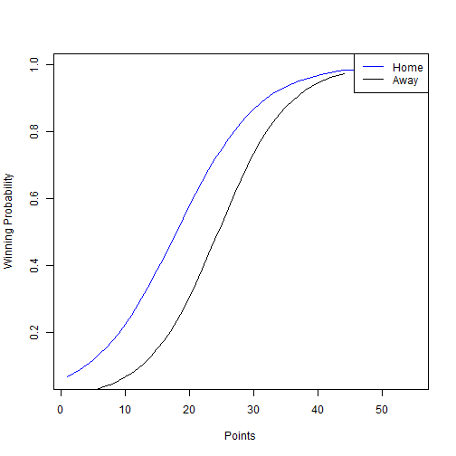

Data Products Course Project
========================================================
author: Mitchell O'Neill
date: Mon May 25 01:30:03 2015

The Pitch
========================================================
Hello Perspective team members and Investors, 

I would like to pitch to you an App that predicts the probability that your favorite team in the NFL will win a game based on a variety of inputs. Arguments regarding the outcome of football games can be both hard fought and impossible to solve before the actual game is played. You may be able to agree on many of the games individual attributes yet still find no conclusion on what the final outcome will be. This App will you allow you to rest your arguments until game day with a projected winning probability. 

The Details
========================================================

The very basic example from this project demonstrates that capability of such an App using only 2 inputs: Field and points scored. The envisioned final product will have a littany of inputs that a user can fill out based on research and intuition and through the completion of these questions they will recieve a calculated probability for their teams chance of winning based on previous year data. 

Basic Predictor Plot
========================================================
The following plot shows the backbone of the predictin algorithim using the 2 predictor variables from the shiny app
 

Final Page
========================================================

Thank  you for reviewing this project. I hope you see the potential for an app backed by a comprehensive prediction algortithim. 

